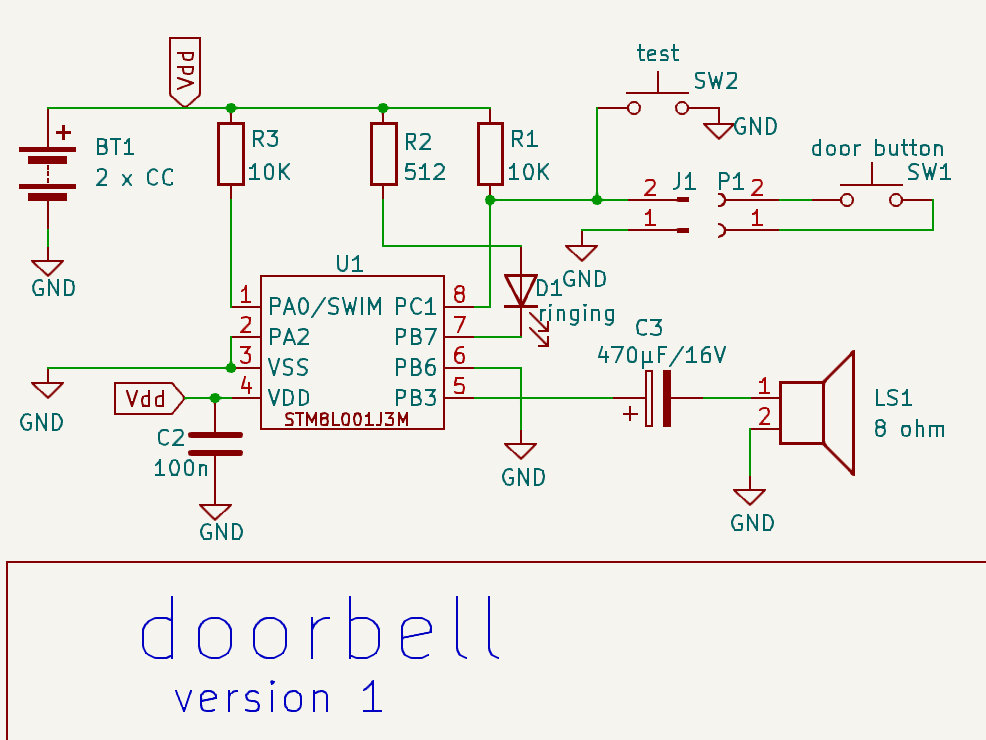
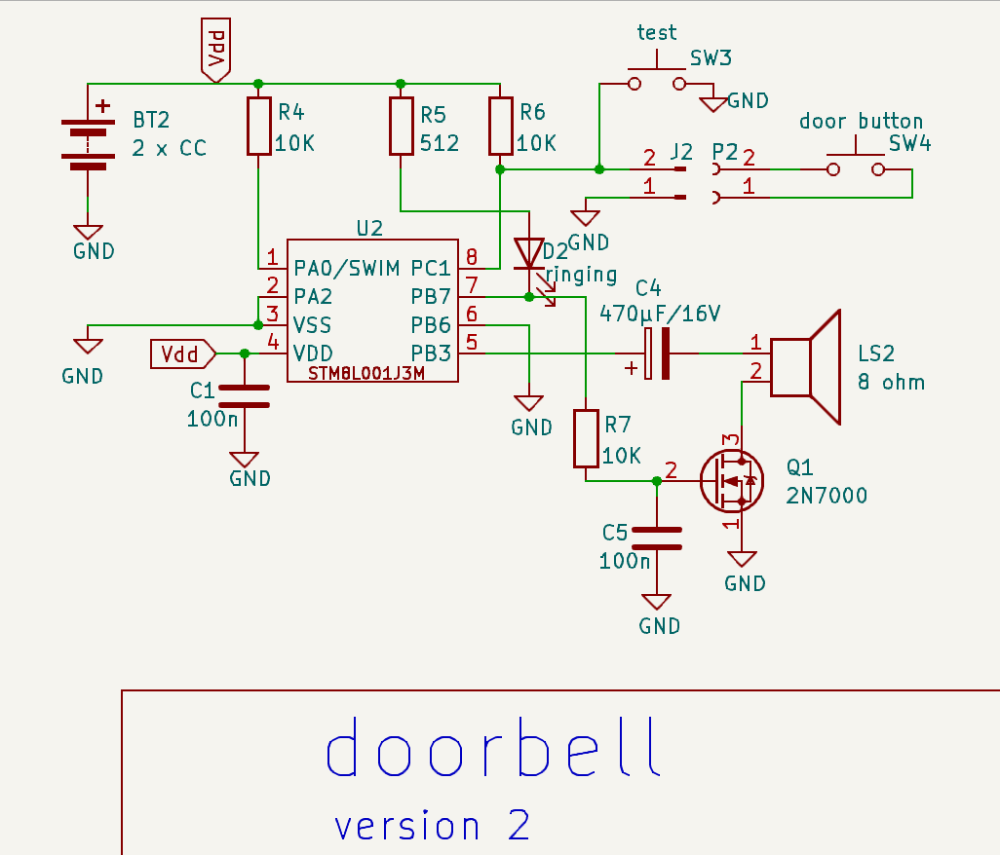

# doorbell

Sonnette d'entrée basée sur un STM8L001J3M et fonctionnant sur 2 piles AA.

Le circuit consomme 2,4µA lorsqu'au repos et 15mA lorsqu'activé.
Joue les 5 notes du thème principal du film **rencontre du 3ième type**. 

## schématique version 1.0

### version 1.1 
Ajout de l'option TREMOLO dans le fichier [app_macros.inc](app_macros.inc).  If faut mettre cette valeur à **1** lorsqu'on utilise le circuit avec trémolo.

## schématique version 2.0 

### Ajout d'un effet trémolo

