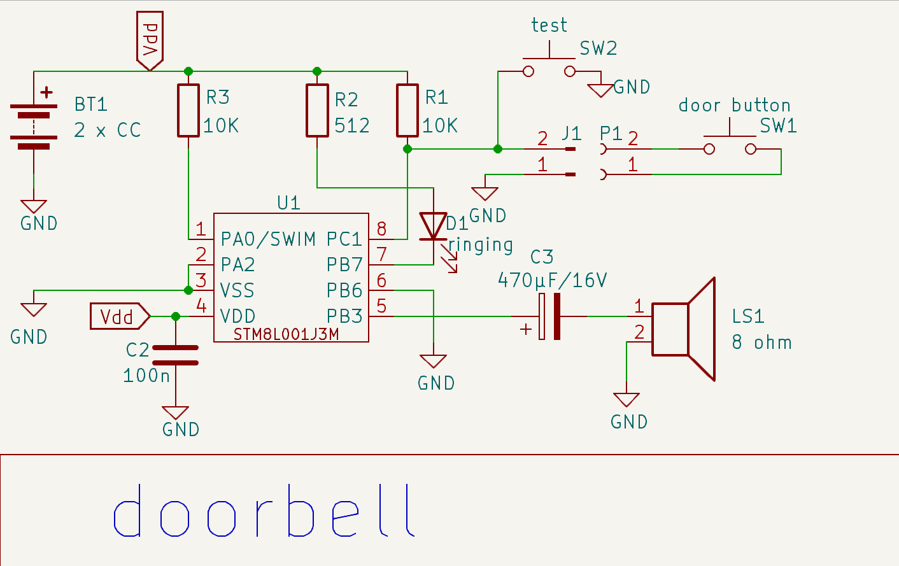

# doorbell

Sonnette d'entrée basée sur un STM8L001J3M et fonctionnant sur 2 piles AA.

Le circuit consomme 19µA lorsqu'au repos et 15mA lorsqu'activé.
Joue les 5 notes du thème principal du film **rencontre du 3ième type**. 

## schématique

